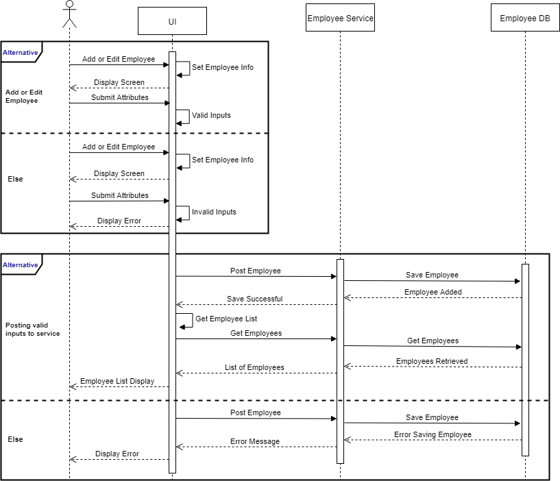

# Full Stack Coding Challenge
Welcome to the IBM BR CIC Full Stack Coding Challenge.  The coding challenge is designed to enhance the skills of IBM resources seeking to build a foundation as a full stack developer.  In this coding challenge, you will implement applications using leading technology stacks to build Single Page Applications (SPA).

# Before You Get Started
1. Install [JDK 1.8](https://www.oracle.com/java/technologies/javase/javase-jdk8-downloads.html) or later.  &nbsp;JDK 1.8 is recommended for the challenge.
2. Install [Node JS](https://nodejs.org/en/download/)
3. Install [Docker Desktop](https://www.docker.com/products/docker-desktop)
4. Preferred IDEs.  However, feel free to use the IDE of your liking.
    * Install [Spring Tool Suite (STS)](https://spring.io/tools) for Java.
    * Install [Visual Studio Code](https://code.visualstudio.com/download)
5. Create a [Docker Hub Account](https://hub.docker.com/) 
6. Create an [IBM Cloud Account](https://cloud.ibm.com) 
7. Create an [IBM GitHub Account](https://github.ibm.com/) 
8. If you are not familiar with Git commands, feel free to find an online training tutorial or enroll in the [Udemy Course - Git for Geeks](https://ibm-learning.udemy.com/course/git-for-geeks/).
9. **Fork** the Git repository to make a copy in your repository.

# Project Information

|Projects                 |Description                                          |
|-------------------------|-----------------------------------------------------|
|angular-ui               |`Angular UI Project`                                 |
|api-gateway              |`Spring Boot Zuul API Gateway Service`               |
|discovery-service        |`Spring Boot Eureka Discovery Service`               |
|employee-db-docker-image |`Contains Dockerfile for building MySQL Employee DB` |
|employee-service         |`Spring Boot Employee Service`                       |
|login-db-docker-image    |`Contains Dockerfile for building MySQL Login DB`    |
|login-service            |`Spring Boot Login Service`                          |
|react-ui                 |`React UI`                                           |

# Deliverables
The coding challenge should be completed in 4 to 6 weeks.  Code snippets are included in the projects to speed along your progress.  However, you must implement the missing code.

## Week 1
> #### Udemy Courses
> - [Docker for the Absolute Beginners – Hands On – DevOps](https://ibm-learning.udemy.com/course/learn-docker/) - 3.5 hours
> - [Microservices with Spring Cloud](https://ibm-learning.udemy.com/course/microservices-with-spring-cloud/) - 4.5 hours

> #### Tasks
> - Create MySQL Docker Images (Login and Employee Databases).
> - Complete Login Service and Containerize.
> - Complete Employee Service and Containerize.
> - Create and Run in Docker Images.
> - Test Docker Images (Postman and MySQL WorkBench).

## Week 2
> #### Udemy Courses
> - [Microservices with Spring Cloud](https://ibm-learning.udemy.com/course/microservices-with-spring-cloud/) (continued)
    
> #### Tasks
> - Implement Eureka Discovery Service and Containerize.
> - Implement Zuul API Gateway Service and Containerize.
> - Validate Eureka Discover Service identified:  Login, Employee, and API Gateway Services.
> - Test Services via Zuul API Gateway.

## Weeks 3 &amp; 4
> #### Udemy Courses
> - [Full Stack:  Angular and Spring Boot](https://ibm-learning.udemy.com/course/full-stack-application-development-with-spring-boot-and-angular/) - 12.5 hours
> - [Go Java Full Stack with Spring Boot and React](https://ibm-learning.udemy.com/course/full-stack-application-with-spring-boot-and-react/) - 11.5 hours
    
> #### Tasks
> - Implement and Containerize Angular UI. 
> - Ensure screen requirements are implemented.
> - Test Angular UI against service components.
> - Repeat above steps for the React UI.

## Weeks 5 &amp; 6 
> ### DEMONSTRATIONS
> - All application components must be running in  Docker Containers.
> - Angular UI and React UI must be running in parallel.
>  ### NEXT:&nbsp;&nbsp;  `Stand up the coding challenge using Docker Compose.`

# Sequence Diagrams

## Login
> #
> 
> #

## Add and Edit Employees
> #
> 
> #
